#屏幕安全性分析
####写在前面的话：1.因资料有限，本试验主要参考了13级师哥师姐的同命题试验，在此基础上略有所拓展和发现，重复的部分不再赘述。在此对师哥师姐们的劳动成果表示非常感谢。2.本试验主要围绕中国建设银行个人网上银行以及一卡通校园充值平台展开。

####基本概念：参阅http://wenku.baidu.com/link?url=x4uB1nDPdQiuZsvYh-Gm-plSIjyBiap3KLvTxMIymz1l9Rqicl-lhnGL_7119WzBMP_MlxRBbkyyyt7_0xBUUVLMSYPyHoUEiKf831s1xAm

##试验过程

####实验环境：
Google Chrome 55.0.2883.95 (64-bit)＋Safari 10.0.1［考虑到师哥师姐的实验环境也是Chrome浏览器，为了呈现不同实验环境下可能的不同结果，原本只选择了实验环境Safari 10.0.1，但是经过笔者在建行个人网银平台的一些尝试性操作后发现，找不到关键字段LOGPASS，而笔者的VPN最近又不太稳定，所以只好两个实验环境结合进行］

####实验工具：
Wireshark 2.0.3［原本没有考虑到使用其他的实验工具，但是笔者的Chrome浏览器无法访问一卡通充值转账平台，而Safari又无法从开发界面查看到Cookie的详细内容，因此想到了用Wireshark进行抓包查看］

####校园卡电子服务平台：
http://ykt.cuc.edu.cn

####中国建设银行个人网上银行登陆：
https://ibsbjstar.ccb.com.cn/CCBIS/V6/common/login.jsp?UDC_CUSTOMER_ID=&UDC_CUSTOMER_NAME=&UDC_COOKIE=ddcd51b64719c89cwdmoLt0QT6Z3YnF9m8YO1483266092289EtGlwFLMeKc2Z92rSCNW8ed65098f1232918f52ea18c76e2158a&UDC_SESSION_ID=wb9HI9M1eLaShjg9822fe57867a-20170101182132

###一卡通校园充值转账支付平台

登录后，点击转账充值，会发现资源—>ykt.cuc.edu.cn—>图像列表中多出两个条目，其中的GetNumKeyPading即是当前屏幕键盘图。而相应的，充值界面的软键盘只有在页面刷新之后才会更新，而非每次输入刷新一次。

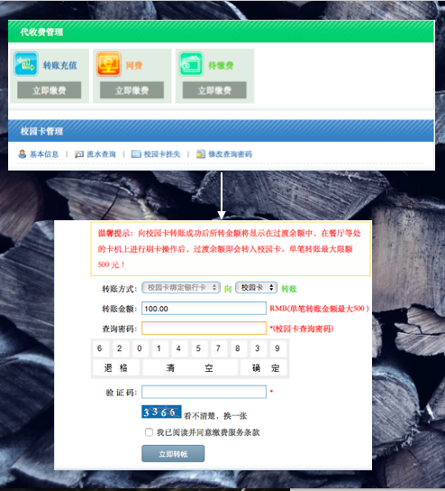

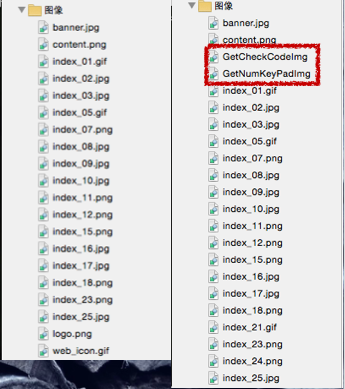

资源—>ykt.cuc.edu.cn—>XHR—>Transfer，找到如上图所示代码，coords表示坐标，而从代码中来看，键盘的坐标似乎是固定的。笔者尝试刷新过几次页面，此段代码并没有改变。而通过前文中可知，键盘的图片又是随着刷新而变化的，因此猜想是否学校的服务器存在某个图片库，每次刷新的时候都向该服务器请求了新的键盘图片？而无论图片上的数字如何分布，实际键盘上的输入总是按照 0～9排列？为此，笔者进行了数次如下尝试。

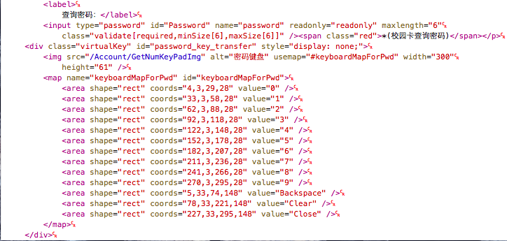

键盘序列：6201457839

操作：维持上述键盘序列，不刷新页面，多次输入执行转账操作，每次点击“立即转账”之前清空缓存，同时用Wireshark开始抓包。

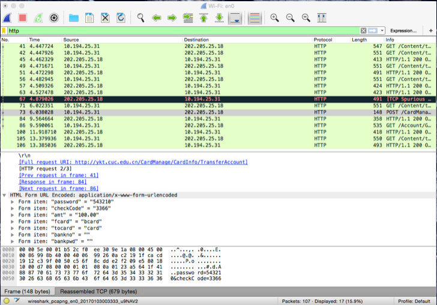

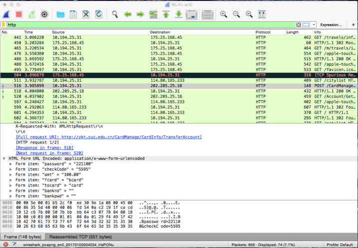
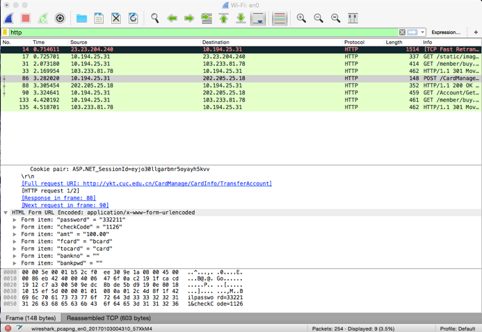
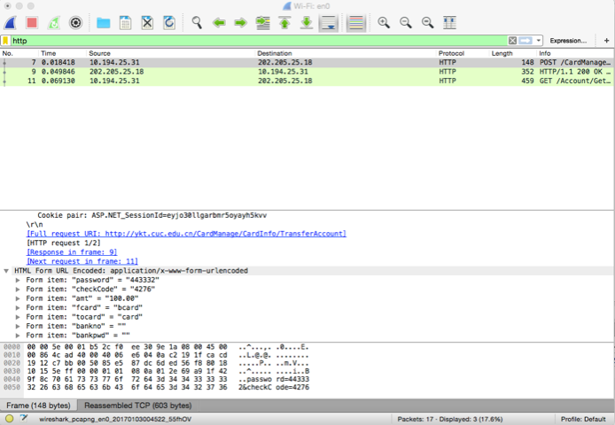

由该表分析可知：
1.如果维持同一屏幕键盘，输入同样的密码，则得到相同的加密密码，由此可证明密码加密算法随机性较低。
2.虽然密码和加密密码中存在某些反转调整，比如试验3中6—>2，2—>1，0—>0，试验5中0—>4，1—>3，4—>2，但是元素的个数都是一一对应的，依然具有可统计性。

###中国建设银行个人网上银行登录平台

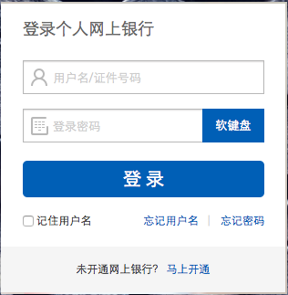

软键盘10次刷新结果图

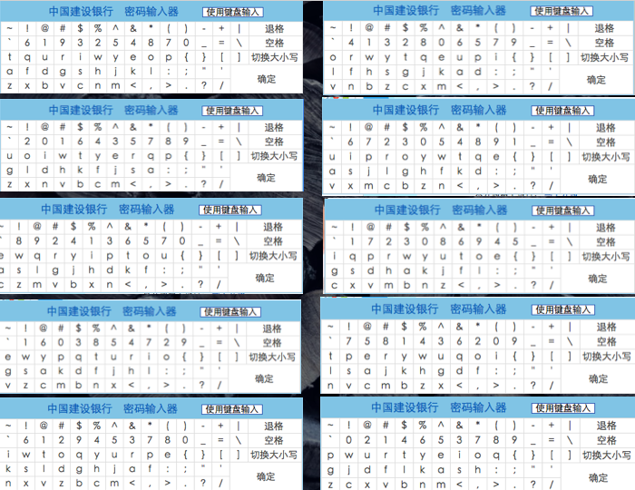

由10次刷新的软键盘截图可知，建行个人网银的用户登录密码输入键盘是随机自绘键盘，但是只有0～9十个数字以及a～z二十六个英文字母是随机分布的，其他的字符位置都是固定的。

打开中国建设银行个人客户网上银行页面后，打开开发者工具，在资源列表里top—>fclogin(B2CMainPlat_00)—>ibsbjstar.ccb.com.cn—>P1StaRes/V6/STY1/CN—>js中找到一个名为“softkeyboard”的js文件。通过阅读分析代码可知，中国建设银行个人网银登陆界面的虚拟键盘共有三种格式：虚拟数字键盘、虚拟键盘、增强版虚拟数字键盘。

其中虚拟键盘的相应部分代码如图所示。

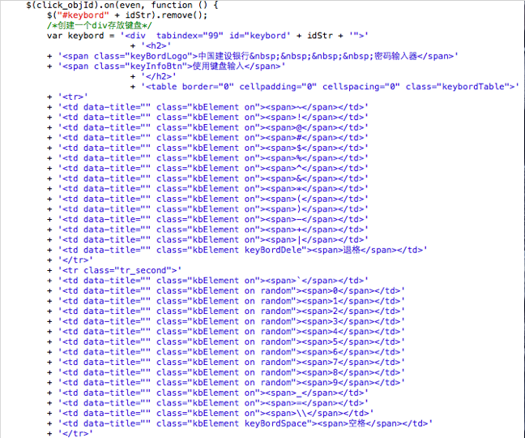

经过了一系列数据测试，对比师哥师姐之前的实验结果截图（上表）可以发现,CCB_PWD_MAP_GIGEST字段的格式有了明显的变化，并且即使是连续不间断刷新输入用户名和密码登录，每一次得到的CCB_PWD_MAP_GIGEST字段的值和LOGPASS都不同，猜想可能提升了算法，为利用CCB_PWD_MAP_GIGEST字段值和LOGPASS字段值的更新时间差进行统计攻击增添了难度。

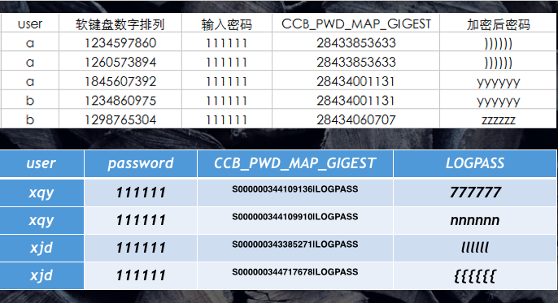

##小结

####一卡通充值转账平台

1.加密算法随机较差，需要定期提升完善。
2.屏幕键盘刷新间隔较长，最好应实现每次输入刷新一次。
3.没有输入密码错误次数限制，最好有所管制，例如设定在3～5次左右。

####中国建设银行个人网上银行登录平台

1.加密算法经过改善后随机性较好，即便输入的密码相同得到的加密密码也不相同。
2.即便不刷新页面，每次输入时的屏幕键盘也不相同。
3.有错误限制次数。
4.密码输入依然保留了物理键盘输入，存在风险。

####总而言之，一卡通充值转账平台安全性较低，即便作为用户在每次输入密码时刷新一下页面，但如果被有心人破解了加密算法，亦是无用。相对来说，建行个人网银登陆平台安全性较高，但是保留物理键盘输入仍然存在风险。而二者是否都存在被截屏攻击的风险因技术限制尚不得而知。

