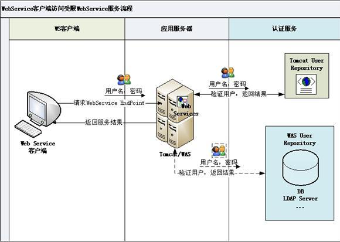

实战之前，先对内容进行比较充分的了解。
一、Basic认证暴力破解
HTTP的asic Authentication_基本认证机制。
据 RFC2617 的规定，HTTP 有两种标准的认证方式，即，BASIC和DIGEST。HTTP Basic Authentication是指客户端必须使用用户名和密码在一个指定的域 (Realm) 中获取认证。它是 Authentication( 认证 ) 中最简单的方法。长期以来，这种认证方法被广泛的使用。当你通过 HTTP 协议去访问一个使用 Basic Authentication 保护的资源时，服务器通常会在 HTTP 请求的 Response 中加入一个"401 需要身份验证"的 Header，来通知客户提供用户凭证，以使用资源。
基本流程：
![](image01.jpg）
Web services 客户端访问受限 Web services 服务流程：

来源：http://www.ibm.com/developerworks/cn/webservices/1106_webservicessecurity/index.html
下面，来了解如何进行暴力破解的。
在所有的应用层协议验证中，HTTP身份验证可能是最容易被暴力破解所攻克的。具体过程很简单，就是嵌套循环组合用户名和密码，然后发送HTTP请求，知道服务器返回200的OK响应为止，用户名可以采用人工输入或者用户名列表文件等方式产生。
