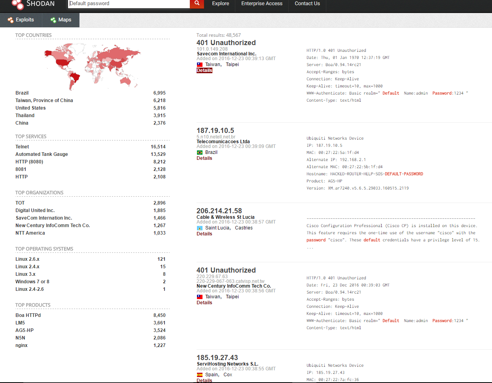
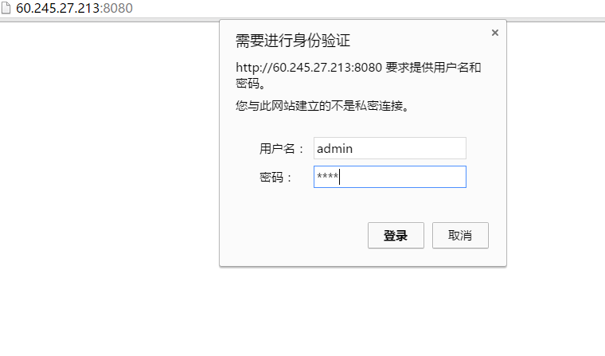
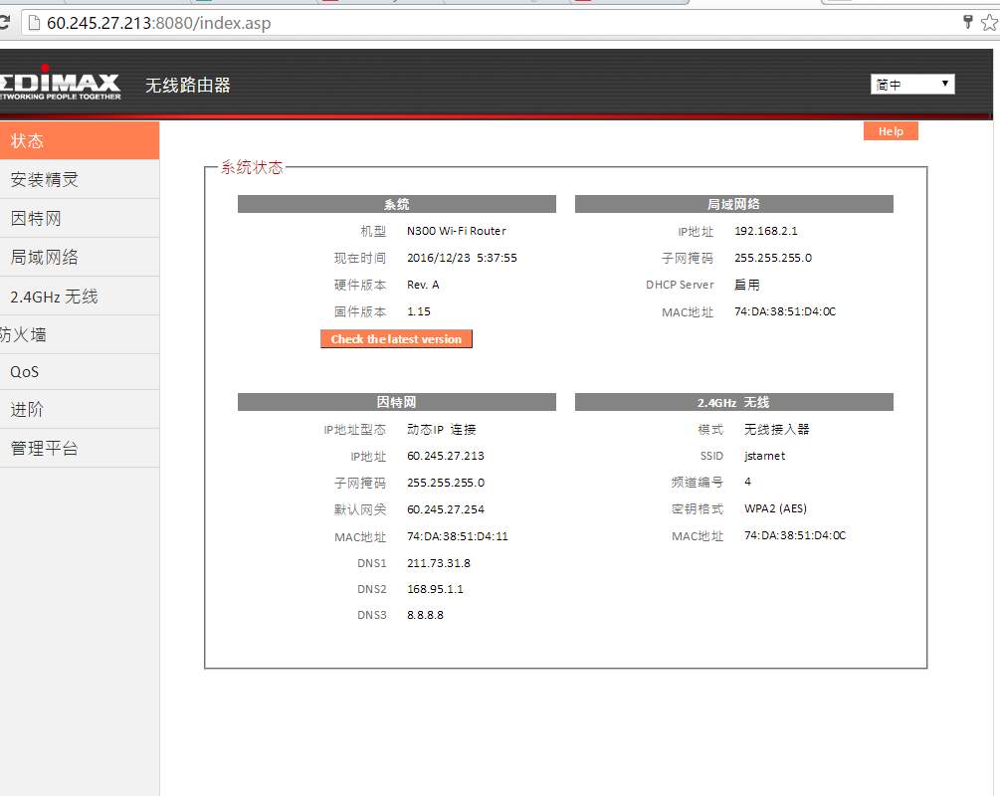
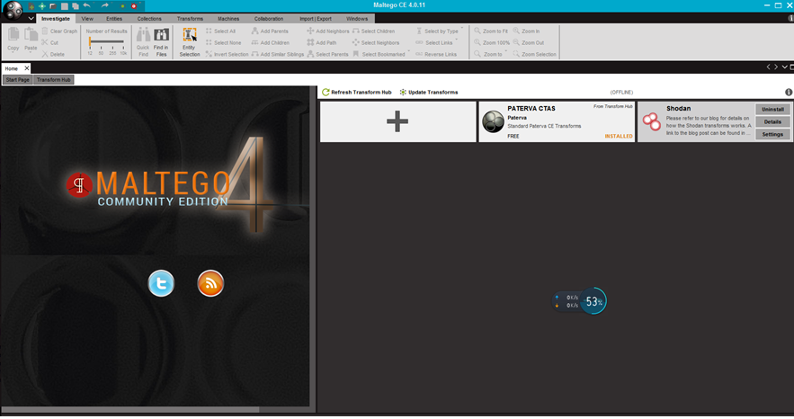
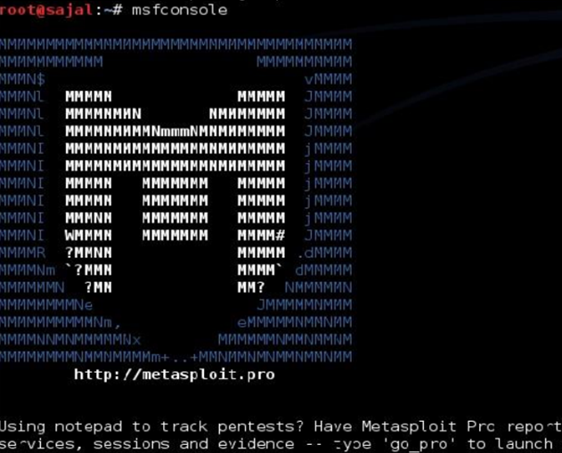
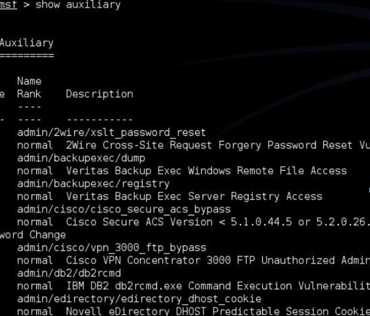
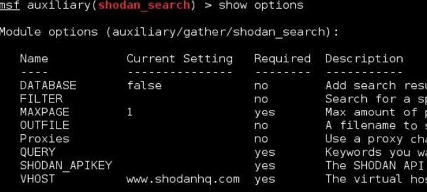
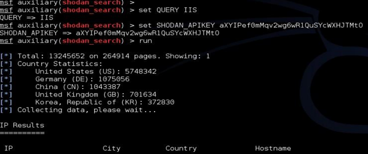

## Shodan深度调研实验

#### 一个小试用！
* 搜索default password，搜索“默认密码”可以发现无数打印机、服务器和系统控制设备都将“admin”作为它们的管理员用户名，将“1234”作为密码。还有很多连网系统根本就不要认证。你只需要一个网络浏览器就可以与它们连网了。通过这些信息，足可见这款搜素引擎的威力。
	* 挑了一个中招的网站，是一个路由器的登录系统：
		* 
		* 
		* 
	* 登录成功之后可以操作试试改密码，别忘了改回去啊。
### Shodan与其他工具结合使用
#### * Maltego：
* Maltego是一套网络情报与侦察应用工具，可以清楚呈现网络环境中的威胁关系图像的平台，它可以将网络架构中的单个实体的所有关系完整的展现出来，根据我们前面的介绍，可想而知，与shodan的结合更是锦上添花。
* 在shodan官网上有相关教程：https://maltego.shodan.io/
* 尝试下载这个工具试用的时候，发现与官网上教程使用有出入，可以之间安装使用shodan，不过使用需要有Shodan的API keys，API keys在你登陆Shodan账户时候可获得的。
		* 

#### *和metasploit的结合使用（未成功）：
* 实验步骤：
	* 1.在kali中打开Metasploit framework。(注意的是使用metasploit之前要先安装启动postgresql，确保端口处于listening状态，然后启动metasploit服务，再启动msfconsole才是如图所示，还可以使用db_status检验一下数据库的连通性)
		* 
	* 2.在命令行中输入show auxiliary
		* 
	* 3.使用 auxiliary/gather/Shodansearch 模块,可以用show options命令来查看模块需要的参数
		* 
		* 
	* 4.我们需要指定iis来搜索iis服务器，还需要登陆Shodan账户后得到的API key。现在我们可以用Run command 登录。
		* 
		* 一般来说 auxiliary/gather/Shodan_search模块通过API向数据库查询前50个ip 地址。50个ip地址的限制可以通过购买无限制API key来扩大到查询10000个ip地址

#### *关于僵尸网络技术与shodan
* shodan在僵尸网络技术运用上也能发挥一定的用处。构建僵尸网络最核心的工作是获取僵尸节点，而使用shodan我们就可以获得大量的现成的僵尸节点。
	* 举个例子：CVE-2015-7755: Juniper ScreenOS Authentication Backdoor，利用该后门漏洞，攻击者可以通过SSH、Telnet以root身份远程登陆ScreenOS设备，直接获得设备控制权。而shodan可以通过搜索关键字“netscreen”来找到这些设备，获得大量设备的控制权，方便快捷的肉机批量产生了。
		* 

###### *介绍了关于这两个应用于安全人员方面的搜索引擎的一些使用，不禁让人思考这种能够轻易找到网络空间中设备组件的工具会不会为黑客所用，更加助长了气焰。不可否认答案是肯定的。但是网络中攻防双方之间的抗争本来就是持续存在的，一定程度的透明和开放反而有助于成长，让这些节点为我们所用也未尝不好。很多时候，问题只有拿到阳光下，才能更快地得到完善。
