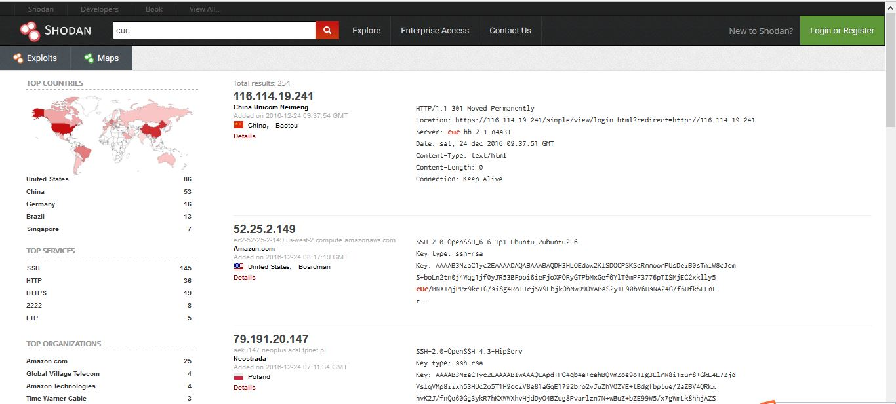
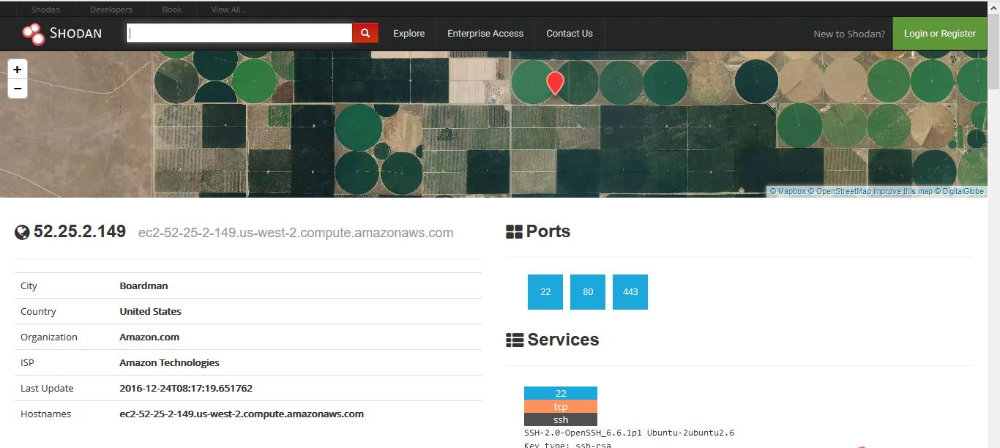
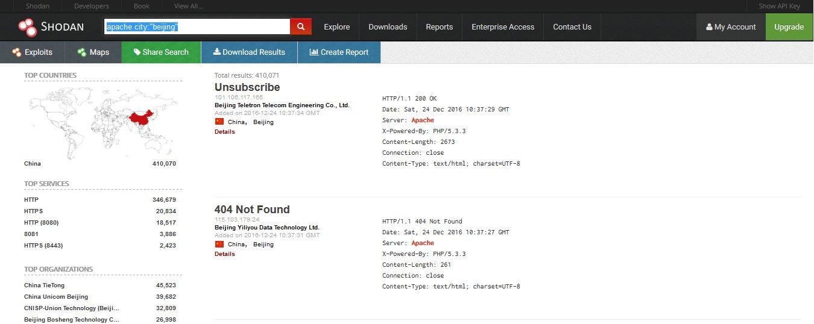

## zoomeye基础介绍

### 背景及简介
* ZoomEye 搜索是国内安全公司知道创宇开发的网络空间搜索引擎，别名“钟馗之眼”，通过这个搜索引擎开放他们的海量数据库。
* Zoomeye是个网络空间的搜索引擎，它不同于传统意义上的搜索引擎，而是一种可以搜索网络组件和网络设备的搜索引擎。这种以各大组件指纹作为识别基础的数据平台，更多的是为了使得安全研究人员更好地评估漏洞的影响范围与其中隐含的数据模式。
### 实现方式
* 网站组件指纹：包括操作系统，Web 服务，服务端语言，Web 开发框架，Web 应用，前端库及第三方组件等等。
* 主机设备指纹：结合 NMAP 大规模扫描结果进行整合。
* ZoomEye 正是一个检索网络空间节点的搜索引擎。通过后端的分布式爬虫引擎（无论谁家的搜索引擎都是这样）对全球节点的分析，对每个节点的所拥有的特征进行判别，从而获得设备类型、固件版本、分布地点、开放端口服务等信息。

### 基本使用规则
* zoomeye给出了 [官方搜索手册](https://www.zoomeye.org/help/manual)，较为具体的查询方式可以链接中找到。下面简单介绍一下常用的搜索方法。

* 输入查询关键词，然后回车看结果。比如你需要查找使用了 Apache 作为 Web 容器的网站，就可以直接输入搜索 apache。apache、php、cms 之类的后端软件我们统称为“组件”。为了更精确展示结果，在最新的版本中将设备检索和 Web 服务检索进行了拆分，并提供细化的筛选支持。 

* 关键字模糊搜索
	* 这是最简单的做法，直接输入单词回车就行了。比如直接输入 router 后点击“公网设备”即可查找 banner（设备返回的“旗帜”信息）中含有“router”单词的设备，大部分都是路由器。
* 按国家 / 地区搜索
	* 在 搜索条件中增加 country 筛选器可以限定结果的地理位置，country: 这个前缀之后，搜索框会自动展开列出所有备选的项目。
* 按照组件和版本搜索
	* 组件名的筛选器格式有变动。现在搜索组件名+版本的语法为 app:组件名 ver:版本设备检索和 Web 服务检索被分成两个入口，原因是这两者具有一些各自独有的筛选器。
* 搜索示例
	* 
	* 
	* 
	
###	与shodan的区别
* 很容易让人想到shodan，其实两者区别很大，主要有以下几条：
	* Zoomeye:关注IP，也关注组件 | shodan只关注IP.以设备搜索为主。
	* Shodan 主要针对的是设备指纹，也就是与某些特定端口通信之后返回的 banner 信息的采集和索引。 
	* ZoomEye 除了设备指纹的检测，还针对某些特定服务加强了探测，比如 Web 服务的细节分析。
	* Shodan只关注联网设备的搜索 | Zoomeye除了联网设备还可搜索网站组件，可以用来对web服务进行细节分析。
